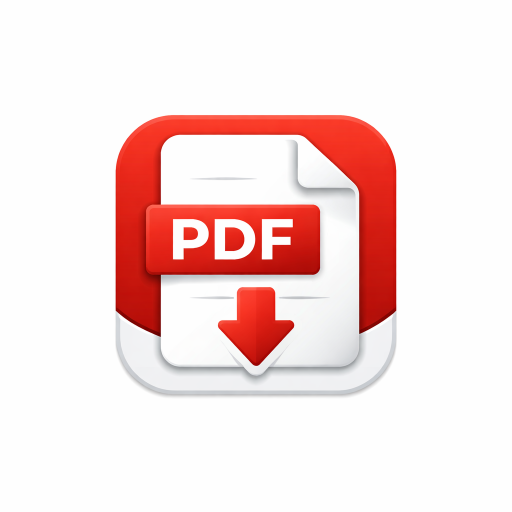

<p align="center">
  
</p>

# 📄 PDF OCR Reader (Offline-First, Android-Friendly)

[](https://opensource.org/licenses/MIT)


An **offline-first PDF reader** that extracts text using OCR, displays structured content, and supports text-to-speech.

The project is designed for **Android and desktop browsers**, with a strong focus on **stability, memory safety, and deterministic behavior**, even when working with large PDF files on low-end devices.

No backend. No paid APIs. No data leaves the device.

---

## ✨ Features

### 📂 PDF Upload & Rendering
- Large PDF support using device-aware performance limits  
- Page range loading (e.g. pages 101–160) to reduce memory usage  
- Mobile-safe rendering to prevent crashes and page reordering issues  
- Single-PDF load protection to avoid race conditions  

### 🧠 OCR (Optical Character Recognition)
- Powered by **Tesseract.js**  
- Hindi and English OCR support  
- Runtime language switching  
- Page-by-page OCR for responsive UI  
- Fully offline processing  

### 🗣️ Text-to-Speech
- Uses the browser’s native Speech Synthesis API  
- Play, Pause, Resume, and Stop controls  
- Adjustable speech rate and voice selection  
- Page-synchronized reading  

### 🖼️ Preview & User Experience
- Correctly ordered thumbnail previews (Android-safe)  
- Full-page preview overlay without interrupting OCR or TTS  
- PDF information panel (file name, page count, file size)  
- Long-press image context menus disabled for a native-app feel  

### ⚡ Performance & Stability
- Device-aware rendering limits based on available memory  
- Async-safe rendering to eliminate race conditions  
- Designed to run reliably on budget Android devices  

---

## 🖼️ Screenshots

### Main Interface


### OCR & Text-to-Speech


---

## 🧱 Architecture Overview

The application follows a **fully modular, event-driven architecture**, with a clean separation between UI, logic, and state.


<details open>
<summary><strong>root/</strong></summary>

<ul>
  <li>index.html</li>
  <li>style.css</li>

  <li>
    <details>
      <summary><strong>src/</strong></summary>
      <ul>
        <li>app.js</li>

        <li>
          <details>
            <summary><strong>core/</strong></summary>
            <ul>
              <li>events.js</li>
              <li>state.js</li>
            </ul>
          </details>
        </li>

        <li>
          <details>
            <summary><strong>ocr/</strong></summary>
            <ul>
              <li>ocrService.js</li>
              <li>ocrWorker.js</li>
            </ul>
          </details>
        </li>

        <li>
          <details>
            <summary><strong>pdf/</strong></summary>
            <ul>
              <li>pageStore.js</li>
              <li>pdfLoader.js</li>
            </ul>
          </details>
        </li>

        <li>
          <details>
            <summary><strong>tts/</strong></summary>
            <ul>
              <li>textChunker.js</li>
              <li>ttsService.js</li>
            </ul>
          </details>
        </li>

        <li>
          <details>
            <summary><strong>ui/</strong></summary>
            <ul>
              <li>controls.js</li>
              <li>copyText.js</li>
              <li>languageSwitch.js</li>
              <li>loader.js</li>
              <li>pageIndicator.js</li>
              <li>pageList.js</li>
              <li>pageRange.js</li>
              <li>pdfInfo.js</li>
              <li>preview.js</li>
              <li>textPanel.js</li>
              <li>voiceControls.js</li>
            </ul>
          </details>
        </li>

        <li>
          <details>
            <summary><strong>utils/</strong></summary>
            <ul>
              <li>performanceLimits.js</li>
            </ul>
          </details>
        </li>

      </ul>
    </details>
  </li>

  <li>
    <details>
      <summary><strong>assets/</strong></summary>
      <ul>
        <li>favicon.ico</li>
        <li>logo.png</li>

        <li>
          <details>
            <summary><strong>icon/</strong></summary>
            <ul>
              <li>icon-192.png</li>
              <li>icon-512.png</li>
            </ul>
          </details>
        </li>
      </ul>
    </details>
  </li>

  <li>
    <details>
      <summary><strong>screenshots/</strong></summary>
      <ul>
        <li>main-ui.png</li>
        <li>ocr-tts.png</li>
      </ul>
    </details>
  </li>

  <li>manifest.json</li>
  <li>service-worker.js</li>
  <li>LICENSE</li>
  <li>README.md</li>
</ul>

</details>


---

## 🚀 Getting Started

### 1️⃣ Clone the repository
```bash
git clone https://github.com/devsQUE/PDF-Reader.git
cd PDF-Reader
```

### 2️⃣ Open in a browser
No build step is required.

Open:
```
index.html
```

### Recommended Browsers
- Chrome  
- Edge  
- Android Chrome / WebView  

---

## 📱 Android Compatibility Notes
- Prevents async rendering and page reordering bugs  
- Disables long-press image context menus  
- Memory-safe rendering for large PDFs  

---

## 🔐 Privacy & Cost
- ❌ No backend server  
- ❌ No API keys  
- ❌ No paid services  

- ✅ Fully offline  
- ✅ User data never leaves the device  

---

## ⚠️ Known Limitations
- OCR accuracy depends on scan quality  
- Browser TTS voice quality varies by device  
- No semantic correction or grammar rewriting  
- Cloud-based AI voices are intentionally excluded  

These are deliberate trade-offs to keep the project **free, private, and offline-first**.

---

## 🧠 Design Philosophy
- Reliability over flashiness  
- Offline-first by default  
- Deterministic behavior on mobile  
- Modular code over monolithic scripts  

The goal is a tool that works **consistently**, even on constrained devices.

---

## 📜 License
This project is licensed under the **MIT License**.  
You are free to use, modify, and distribute it.
