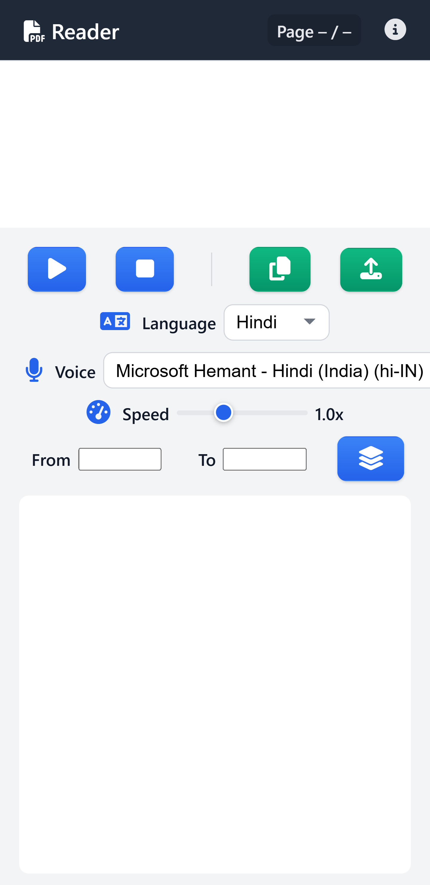
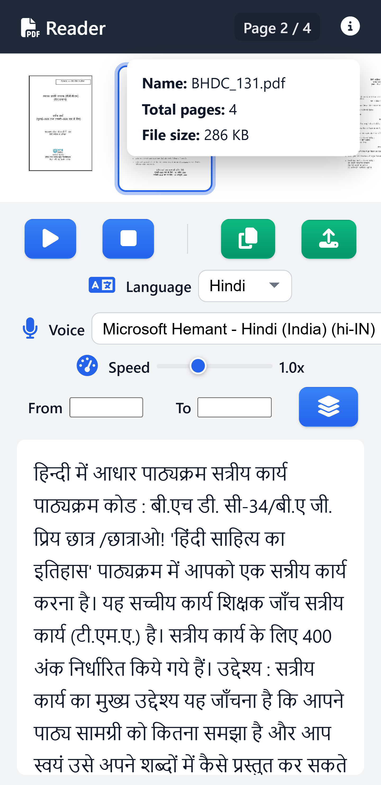

# 📄 PDF OCR Reader (Offline-First, Android-Friendly)

[](https://opensource.org/licenses/MIT)


An **offline-first PDF reader** that extracts text using OCR, displays structured content, and supports text-to-speech.

The project is designed for **Android and desktop browsers**, with a strong focus on **stability, memory safety, and deterministic behavior**, even when working with large PDF files on low-end devices.

No backend. No paid APIs. No data leaves the device.

---

## ✨ Features

### 📂 PDF Upload & Rendering
- Large PDF support using device-aware performance limits  
- Page range loading (e.g. pages 101–160) to reduce memory usage  
- Mobile-safe rendering to prevent crashes and page reordering issues  
- Single-PDF load protection to avoid race conditions  

### 🧠 OCR (Optical Character Recognition)
- Powered by **Tesseract.js**  
- Hindi and English OCR support  
- Runtime language switching  
- Page-by-page OCR for responsive UI  
- Fully offline processing  

### 🗣️ Text-to-Speech
- Uses the browser’s native Speech Synthesis API  
- Play, Pause, Resume, and Stop controls  
- Adjustable speech rate and voice selection  
- Page-synchronized reading  

### 🖼️ Preview & User Experience
- Correctly ordered thumbnail previews (Android-safe)  
- Full-page preview overlay without interrupting OCR or TTS  
- PDF information panel (file name, page count, file size)  
- Long-press image context menus disabled for a native-app feel  

### ⚡ Performance & Stability
- Device-aware rendering limits based on available memory  
- Async-safe rendering to eliminate race conditions  
- Designed to run reliably on budget Android devices  

---

## 🖼️ Screenshots

### Main Interface


### OCR & Text-to-Speech


---

## 🧱 Architecture Overview

The application follows a **fully modular, event-driven architecture**, with a clean separation between UI, logic, and state.


```
root/
├── index.html
├── style.css
├── app.js                     # Application entry point
├── src/
│   ├── core/
│   │   ├── events.js          # Global event bus
│   │   └── state.js           # Central state management
│   ├── ocr/
│   │   ├── ocrService.js      # OCR pipeline (Tesseract.js)
│   │   └── ocrWorker.js       # Worker thread
│   ├── pdf/
│   │   ├── pageStore.js       # Page data storage
│   │   └── pdfLoader.js       # PDF.js rendering logic
│   ├── tts/
│   │   ├── textChunker.js     # Text chunking logic
│   │   └── ttsService.js      # Browser TTS service
│   ├── ui/
│   │   ├── controls.js
│   │   ├── copyText.js
│   │   ├── languageSwitch.js
│   │   ├── loader.js
│   │   ├── pageIndicator.js
│   │   ├── pageList.js
│   │   ├── pageRange.js
│   │   ├── pdfInfo.js
│   │   ├── preview.js
│   │   ├── textPanel.js
│   │   └── voiceControls.js
│   └── utils/
│       └── performanceLimits.js
├── screenshots/
│   ├── main-ui.png
│   └── ocr-tts.png
├── favicon.ico
├── LICENSE
└── README.md
```

---

## 🚀 Getting Started

### 1️⃣ Clone the repository
```bash
git clone https://github.com/devsQUE/PDF-Reader.git
cd PDF-Reader
```

### 2️⃣ Open in a browser
No build step is required.

Open:
```
index.html
```

### Recommended Browsers
- Chrome  
- Edge  
- Android Chrome / WebView  

---

## 📱 Android Compatibility Notes
- Prevents async rendering and page reordering bugs  
- Disables long-press image context menus  
- Memory-safe rendering for large PDFs  

---

## 🔐 Privacy & Cost
- ❌ No backend server  
- ❌ No API keys  
- ❌ No paid services  

- ✅ Fully offline  
- ✅ User data never leaves the device  

---

## ⚠️ Known Limitations
- OCR accuracy depends on scan quality  
- Browser TTS voice quality varies by device  
- No semantic correction or grammar rewriting  
- Cloud-based AI voices are intentionally excluded  

These are deliberate trade-offs to keep the project **free, private, and offline-first**.

---

## 🧠 Design Philosophy
- Reliability over flashiness  
- Offline-first by default  
- Deterministic behavior on mobile  
- Modular code over monolithic scripts  

The goal is a tool that works **consistently**, even on constrained devices.

---

## 📜 License
This project is licensed under the **MIT License**.  
You are free to use, modify, and distribute it.
